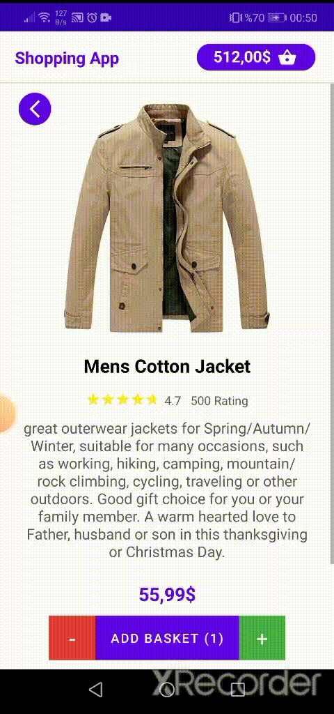
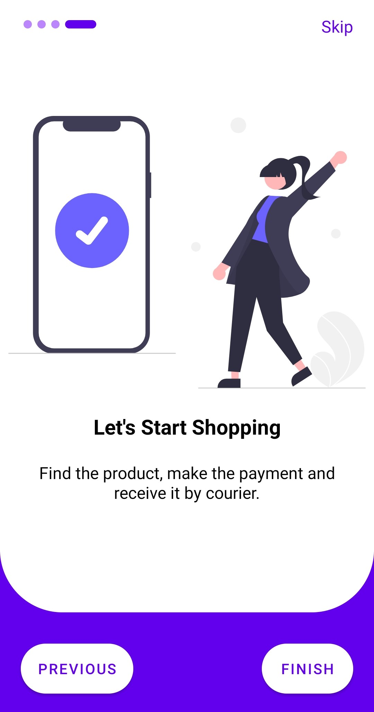
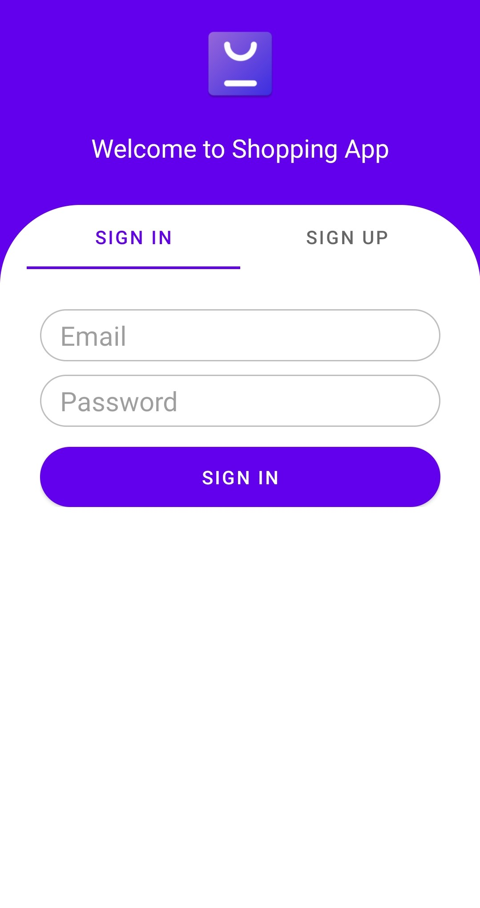
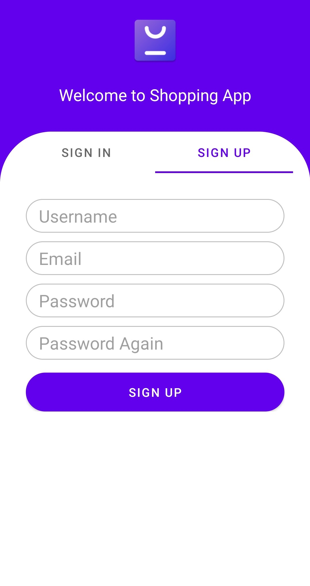
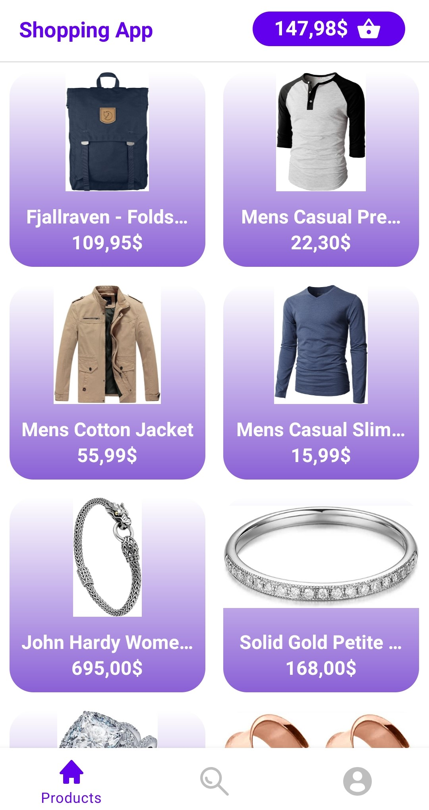

# Shopping App

## Table of Contents
* [Summary](#summary)
* [Project Structure](#project-structure)
* [Architecture](#architecture)
* [Requirements](#requirements)
* [Contact](#contact)

## Summary
This is a simple shopping application. Developed using kotlin for android. It lists the products, shows the product details, has a search page, shows the products by category, you can add the products to the basket by quantity. Basket provides an opportunity to increase, decrease the number of products and see the total amount. This  application is coded in accordance with the single activity principle. Androidx and 3rd party libraries are used. It works with the [Fake Store API.](https://fakestoreapi.com/)

## Project Structure
* <b>Splash:</b> It is the opening screen of the application.
* <b>Auth:</b> This page provides options to sign-in and sign-up.
* <b>Main Menu:</b> Includes Products, Search and Profile pages
* <b>Products:</b> Lists products
* <b>Search:</b> Allows you to search for products and sort by category
* <b>Profile:</b> Shows your account information and provides a button to log out of your account.
* <b>Product Details:</b> Shows product details, allows you to add the product to the basket
* <b>Basket:</b> The products you add to the basket appear on this page. You can increase or decrease the number of products. It shows the total amount and provides a button for purchase.

## Architecture
MVVM (Model-View-ViewModel) architecture pattern and data binding is used in the development of this application. Codes were written by following the Clean Architecture method.

* Architecture
    * [Data Binding](https://developer.android.com/topic/libraries/data-binding/)
    * [ViewModel](https://developer.android.com/topic/libraries/architecture/viewmodel)
    * [LiveData](https://developer.android.com/topic/libraries/architecture/livedata)
    * [Navigation](https://developer.android.com/guide/navigation)
    * [DataStore](https://developer.android.com/topic/libraries/architecture/datastore)

* Third Parties
    * [Firebase](https://firebase.google.com)
    * [Firebase Auth](https://firebase.google.com/docs/auth)
    * [Firebase Cloud Firestore](https://firebase.google.com/products/firestore)
    * [Retrofit](https://square.github.io/retrofit/)
    * [Glide](https://github.com/bumptech/glide)
    * [Lifecycle](https://developer.android.com/jetpack/androidx/releases/lifecycle)
    * [Kotlin Coroutines](https://developer.android.com/kotlin/coroutines)
    * [Kotlin Parcelize](https://developer.android.com/kotlin/parcelize)
    * [Lottie Library](https://github.com/airbnb/lottie-android)
    * [Gson](https://github.com/google/gson)
    *[huawei](https://developer.huawei.com/consumer/en/codelab/HMSPushKit/index.html#0)
## Requirements
- Android Studio Chipmunk | 2021.2.1 Patch 2
- Android Studio's Gradle JDK version should be Java 11.0.10.
- Create Firebase App
    - Enable -> Firebase Auth
    - Enable -> Firebase Cloud Firestore
